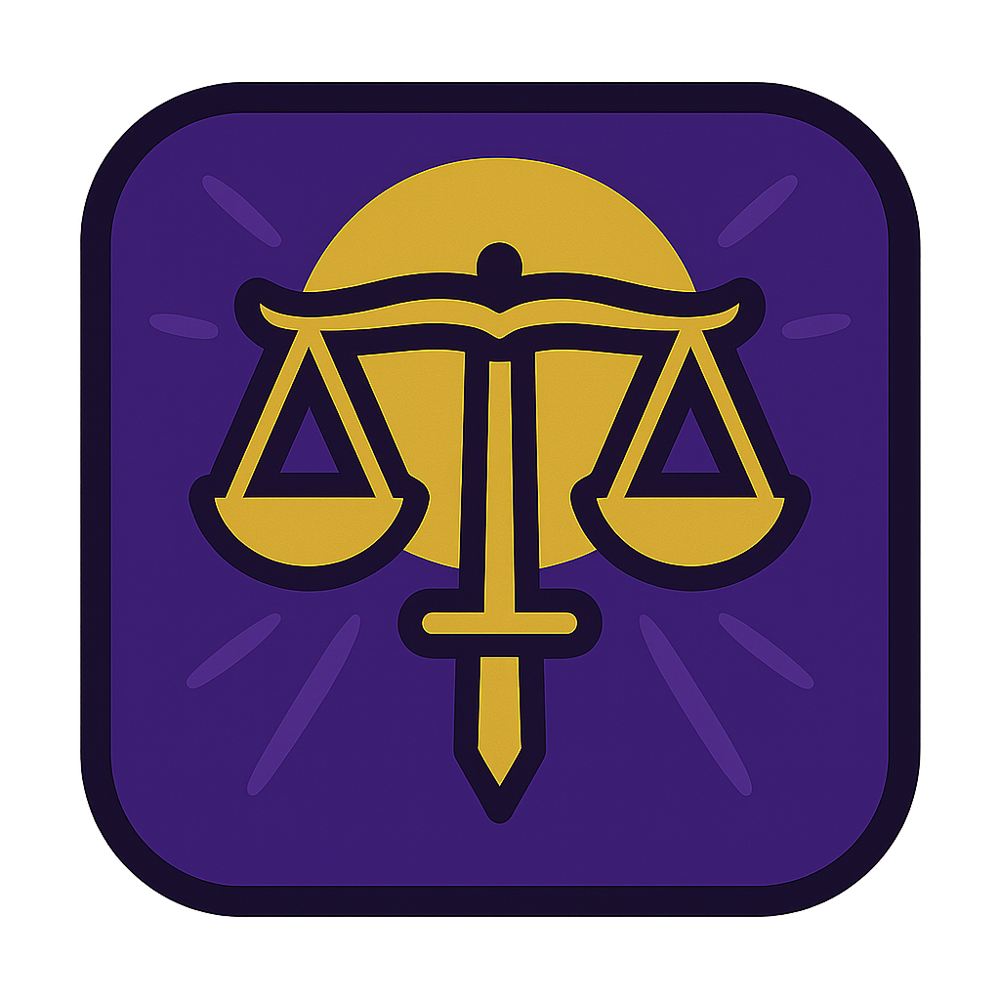

# Rhea

An AI-powered curriculum generation tool for peer-led learning cohorts. Rhea uses Claude AI with optional web research to generate comprehensive, up-to-date module specifications and complete multi-week course structures and module specifications.


---

## 1. What Rhea Does

Rhea contains multiple workflows & utilities for curriculum generation and management:

**Themis**                        | **Tethys**                        | **Metis**                       | **Theia**
:--------------------------------:|:---------------------------------:|:-------------------------------:|:------------------------------:
 |  |  |   
*Curriculum Creation*             | *Arc Creation*                    | *Module Creation*               | *Import, Export & Preview*

### 1.1. Key value

Rhea can use web search to ensure your curriculum reflects current industry practices and technologies, not just what Claude knew at training time.

### 1.2. Workflows

<details><summary><strong>Themis:</strong> complete multi-week courses</summary>
  <div>
    <ul>
      <li>Thematic arcs organizing related modules</li>
      <li>Learning progression across modules</li>
      <li>Course-level narratives and structure</li>
      <li>Course-aware individual module generation</li>
      <li>Real-time generation progress tracking</li>
    </ul>
  </div>
</details>

<details><summary><strong>Tethys:</strong> Arc generation and management tools (planned)</summary>
  <div>
    <ul>
      <li>Standalone arc creation between course and module levels</li>
      <li>Arc-level learning progression design</li>
      <li>Thematic coherence across related modules</li>
    </ul>
  </div>
</details>

<details><summary><strong>Metis:</strong> standalone module specifications</summary>
  <div>
    <ul>
      <li>Learning objectives and module overview</li>
      <li>Detailed project briefs with examples and success criteria</li>
      <li>Research topics with guidance for learners</li>
      <li>Additional skills categorized by importance</li>
      <li>Project "twists" to add interesting challenges</li>
    </ul>
  </div>
</details>

### 1.3. Utilities

<details><summary><strong>Theia:</strong> content management and export</summary>
  <div>
    <ul>
      <li>Upload previously generated course JSON files</li>
      <li>Resume workflows from where you left off</li>
      <li>Export to Markdown, HTML, or JSON formats</li>
      <li>Configurable detail levels and section selection</li>
      <li>Round-trip capability: export → upload → continue</li>
    </ul>
  </div>
</details>

### 1.4. Coming Soon

- <strong>Mnemosyne:</strong> long-term storage and versioning
- <strong>Thalassa:</strong> <strong>At</strong>omic <strong>L</strong>earning <strong>As</strong>sembler

---

## 2. Quick Start

### 2.1. Prerequisites

- Node.js 20+
- Anthropic API key ([get one here](https://console.anthropic.com/))

### 2.2. Installation

```bash
# Clone repository
git clone https://github.com/foundersandcoders/rhea.git
cd rhea

# Install dependencies
npm install

# Configure environment
cp .env.example .env
# Edit .env and add: ANTHROPIC_API_KEY=sk-ant-api03-xxxxx

# Run development server
npm run dev
```

Open **http://localhost:5173** to start using Rhea.

**See [Getting Started Guide](/docs/Getting-Started.md) for detailed installation and usage instructions.**

---

## 3. Cost Information

- Claude Sonnet 4.5 pricing: ~£2.20/million input tokens, ~£11/million output tokens
- Typical module generation: **£0.15-£0.30** (with research enabled)
- Course structure generation: **£0.10-£0.20**
- New Anthropic accounts often include free credits

---

## 4. Key Features

### 4.1. Themis

<details><summary>Complete multi-week courses</summary>
  <div>
    <ol>
      <li>Configure course identity and logistics</li>
      <li>Plan thematic arcs</li>
      <li>Organize modules within arcs</li>
      <li>AI generates detailed structure</li>
      <li>Review and refine structure</li>
      <li>Generate individual modules with course context</li>
      <li>Export complete course (Markdown, HTML, or JSON)</li>
    </ol>
  </div>
</details>


---

### 4.2. Tethys

> [!NOTE]
> Coming soon


---

### 4.3. Metis

<details><summary>Quick standalone modules</summary>
  <div>
    <ol>
      <li>Upload XML inputs (projects, skills, research)</li>
      <li>Provide structured context</li>
      <li>Generate with optional research</li>
      <li>Export preview or download XML specification</li>
    </ol>
  </div>
</details>


---

### 4.4. Theia

<details><summary><strong>Theia:</strong> Content Management & Export</summary>
  <div>
    <ul>
      <li>Upload &amp; Resume: Upload JSON course files to continue workflows in Themis</li>
      <li>Round-trip capability: Export → upload → continue working seamlessly</li>
      <li>Multiple formats: Markdown, HTML, JSON (PDF planned)</li>
      <li>Flexible detail levels: Minimal, summary, detailed, or complete</li>
      <li>Selective exports: Choose specific sections to export</li>
      <li>Course or module exports: Works with both Metis and Themis outputs</li>
      <li>Table of contents: Optional navigation for longer exports</li>
      <li>Drag-and-drop interface: Easy file upload with validation</li>
    </ul>

    <p>Export at any stage, then re-upload to continue work later. Upload existing course structures to review, refine, or generate additional modules.</p>
  </div>
</details>


---

### 4.5. Additional Features

<details><summary>📝 Change Tracking & Provenance</summary>
  <div>
    <p>Every generated module includes comprehensive change tracking to support the <strong>cascade pattern</strong> — where AI-generated modules are updated iteratively whilst maintaining human oversight:</p>

    <ul>
      <li><strong>Automatic Changelog</strong>: Documents what changed, why, and with what confidence level</li>
      <li><strong>Confidence Scoring</strong>: High/medium/low confidence flags help reviewers prioritize</li>
      <li><strong>Research Citations</strong>: Web research sources automatically cited</li>
      <li><strong>Provenance Tracking</strong>: Shows when generated, by which model, and flags sections needing review</li>
    </ul>

    <p>This enables curriculum councils to:</p>

    <ul>
      <li>Quickly identify what's been updated since last version</li>
      <li>Focus review time on low-confidence changes</li>
      <li>Understand rationale behind AI-proposed updates</li>
      <li>Track sections needing human review</li>
    </ul>

    <p>See <a href="/docs/dev/work-records/changelog-schema-design.md">Changelog Schema Design</a> for technical details.</p>
  </div>
</details>

<details><summary>🔬 Deep Research Capability</summary>
  <div>
    <p>Enable web search during generation to:</p>
    <ul>
      <li>Verify technologies/practices are current</li>
      <li>Update recommendations based on industry trends</li>
      <li>Search trusted domains: vendor docs, GitHub, Stack Overflow, academic sources</li>
      <li>Cite sources for transparency</li>
    </ul>

    <p><strong>This is the core value</strong> — without research, you're just reformatting existing content.</p>
  </div>
</details>

<details><summary>🌐 Domain Configuration</summary>
  <div>
    <p>Control which websites Claude can research during generation:</p>
    
    <h4>Predefined Lists</h4>
    <ul>
      <li><strong>AI Engineering</strong> - Curated list of 29 trusted sources (vendor docs, GitHub, Stack Overflow, academic papers)</li>
      <li><strong>No Restrictions</strong> - Allow research on any domain</li>
    </ul>

    <h4>Custom Domains</h4>
    <p>Add your own domains to the allowlist:</p>
    <ul>
      <li><code>example.com</code> - Standard domain</li>
      <li><code>*.github.com</code> - Wildcard for all subdomains</li>
      <li><code>example.com/blog</code> - Specific path within domain</li>
    </ul>

    <h4>In Metis (Standalone Modules)</h4>
    <ul>
      <li>Select domain list or "No Restrictions"</li>
      <li>Add custom domains as needed</li>
      <li>Configuration in "Advanced Research Options"</li>
    </ul>

    <h4>In Themis (Course Builder)</h4>
    <p>Hierarchical configuration at three levels:</p>
    <ul>
      <li><strong>Course Level</strong> - Set for entire course, or configure per arc</li>
      <li><strong>Arc Level</strong> - Set for all modules in arc, or configure per module</li>
      <li><strong>Module Level</strong> - Enable or disable research</li>
    </ul>
    <p>Child configurations inherit from parent unless explicitly overridden.</p>
  </div>
</details>

<details><summary>✅ Schema Validation</summary>
  <div>
    <p>All generated modules are automatically validated against requirements:</p>
    <ul>
      <li>Minimum 3 module objectives</li>
      <li>Minimum 5 primary research topics</li>
      <li>Minimum 2 project briefs with detailed criteria</li>
      <li>Automatic retry (up to 3 attempts) if validation fails</li>
    </ul>
  </div>
</details>

---

## 5. Documentation

### 5.1. For Users

- <a href="/docs/Getting-Started.md">Getting Started</a> - Installation, setup, first module
- <a href="/docs/About-Rhea.md">About Rhea</a> - What it does and why it exists
- <a href="/docs/Executive-Summary.md">Executive Summary</a> - Quick overview

### 5.2. For Developers

- <a href="/docs/dev/Technical-Overview.md">Technical Overview</a> - Architecture, components, patterns
- <a href="/docs/dev/Architecture-Decisions.md">Architecture Decisions</a> - Historical context and rationale
- <a href="/docs/dev/work-records/changelog-schema-design.md">Changelog Schema Design</a> - Change tracking implementation

### 5.3. For Contributors

- <a href="/docs/dev/roadmap/">Roadmaps</a> - Feature status and priorities
  - <a href="/docs/dev/roadmap/Rhea-MVP.md">Rhea Roadmap</a>
  - <a href="/docs/dev/roadmap/Metis-MVP.md">Metis Roadmap</a>
  - <a href="/docs/dev/roadmap/Themis-MVP.md">Themis Roadmap</a>
  - <a href="/docs/dev/roadmap/Theia-MVP.md">Theia Roadmap</a>
- <a href="/CLAUDE.md">CLAUDE.md</a> - AI assistant guidance

---

## 6. Metis: Input File Format

Metis accepts XML files for module inputs. Each file must have a specific root element:

<details><summary><code>projects.xml</code></summary>
  <div>
    <pre>
  &lt;Projects&gt;
    &lt;ProjectBriefs&gt;
      &lt;ProjectBrief&gt;
        &lt;Overview&gt;
          &lt;Name&gt;Project Name&lt;/Name&gt;
          &lt;Task&gt;What learners will build&lt;/Task&gt;
          &lt;Focus&gt;Key technologies and techniques&lt;/Focus&gt;
        &lt;/Overview&gt;
        &lt;Criteria&gt;Success criteria as bullet points&lt;/Criteria&gt;
        &lt;Skills&gt;
          &lt;Skill&gt;
            &lt;Name&gt;Skill Name&lt;/Name&gt;
            &lt;Details&gt;What learners will learn&lt;/Details&gt;
          &lt;/Skill&gt;
        &lt;/Skills&gt;
        &lt;Examples&gt;
          &lt;Example&gt;
            &lt;Name&gt;Example Name&lt;/Name&gt;
            &lt;Description&gt;Brief description&lt;/Description&gt;
          &lt;/Example&gt;
        &lt;/Examples&gt;
      &lt;/ProjectBrief&gt;
    &lt;/ProjectBriefs&gt;
  &lt;/Projects&gt;
    </pre>

    <p><strong>Minimal valid:</strong></p>
    <pre>&lt;Projects&gt;&lt;/Projects&gt;</pre>
  </div>
</details>

<details><summary><code>skills.xml</code></summary>
  <div>
    <pre>
  &lt;AdditionalSkills&gt;
    &lt;SkillsCategory&gt;
      &lt;Name&gt;Category Name&lt;/Name&gt;
      &lt;Skill&gt;
        &lt;SkillName&gt;Specific Skill&lt;/SkillName&gt;
        &lt;Importance&gt;Recommended / Stretch / Essential&lt;/Importance&gt;
        &lt;SkillDescription&gt;Brief description&lt;/SkillDescription&gt;
      &lt;/Skill&gt;
    &lt;/SkillsCategory&gt;
  &lt;/AdditionalSkills&gt;
    </pre>

    <p><strong>Minimal valid:</strong></p>
    <pre>&lt;Skills&gt;&lt;/Skills&gt;</pre>
    <p>or</p>
    <pre>&lt;AdditionalSkills&gt;&lt;/AdditionalSkills&gt;</pre>
  </div>
</details>

<details><summary><code>research.xml</code></summary>
  <div>
    <pre>
  &lt;ResearchTopics&gt;
    &lt;PrimaryTopics&gt;
      &lt;PrimaryTopic&gt;
        &lt;TopicName&gt;Topic Name&lt;/TopicName&gt;
        &lt;TopicDescription&gt;What to research and how to approach it&lt;/TopicDescription&gt;
      &lt;/PrimaryTopic&gt;
    &lt;/PrimaryTopics&gt;
  &lt;/ResearchTopics&gt;
    </pre>

    <p><strong>Minimal valid:</strong></p>
    <pre>&lt;ResearchTopics&gt;&lt;/ResearchTopics&gt;</pre>
  </div>
</details>

**See [Getting Started Guide](/docs/Getting-Started.md) for common XML gotchas and detailed format specifications.**

---

## 7. Technical Stack

- <strong>SvelteKit</strong> - Application framework with SSR and API routes
- <strong>Node.js 20+</strong> - Runtime environment
- <strong>LangChain + Claude</strong> - AI orchestration (Claude Sonnet 4.5)
- <strong>Zod</strong> - Runtime validation and type safety
- <strong>XML</strong> - Curriculum data format

**See [Technical Overview](/docs/dev/Technical-Overview.md) for architecture details.**

---

## 8. Development

```bash
# Install dependencies
npm install

# Run development server
npm run dev

# Build for production
npm run build

# Preview production build
npm run preview
```

---

## 9. Deployment

Rhea can deploy to:
- Vercel
- Netlify
- Node.js servers
- Other platforms (see <a href="https://kit.svelte.dev/docs/adapters">SvelteKit adapters</a>)

**Important:** Set `ANTHROPIC_API_KEY` in your hosting platform's environment variables.

---

## 10. Contributing

Issues and pull requests welcome! Check the <a href="/docs/dev/roadmaps/">roadmaps</a> for current priorities.

---

## 11. License

Built for peer-led learning communities.

---

**Need help?** See the <a href="/docs/Getting-Started.md">Getting Started Guide</a> or create an issue.
